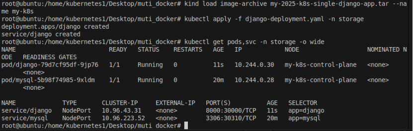

# Case Study 1: Deploying a Django Web Page on a k8s Cluster

**Prerequisites:**
1. A kind-based k8s cluster has been set up on **Ubuntu 20.04**.
2. The kind cluster name is **`my-k8s`**.

**Note:** All related files are stored under the `learn-k8s-django` directory.

---

## Building a MySQL Database in k8s

1. First, import the MySQL image.

2. Write the YAML manifest:  
   See **`sql-k8s.yaml`**.

3. Deploy to Kubernetes:
```bash
kubectl apply -f sql-k8s.yaml
```

---

## Building the Django Web Image

1. Create a new Django project.

2. Modify the project settings in **`settings.py`** to use MySQL:
```python
DATABASES = {
    'default': {
        'ENGINE': 'django.db.backends.mysql',
        "NAME": "mytest",
        "USER": "root",
        "PASSWORD": os.environ.get("MYSQL_ROOT_PASSWORD"),  # Get password from environment variable
        "HOST": "mysql.storage.svc.cluster.local",          # DNS address of the MySQL Service
        "PORT": "3306",                                     # Default MySQL port
        "OPTIONS": {
            "charset": "utf8mb4",                           # Use utf8mb4 to support emojis, etc.
            "init_command": "SET sql_mode='STRICT_TRANS_TABLES'"
        },
    }
}
```

4. Save the file, then create **`requirements.txt`** and **`Dockerfile`** in the project directory.

**requirements.txt**
```txt
Django==5.0
mysqlclient==2.2.4
gunicorn==23.0.0
```

**Dockerfile**
```Dockerfile
# Use the official Python image as the base
FROM python:3.10-slim

# Set working directory
WORKDIR /app

# Install dependencies required to build mysqlclient
RUN apt-get update && \
    apt-get install -y --no-install-recommends \
    build-essential \
    gcc \
    pkg-config \
    libmariadb-dev \
    libmariadb-dev-compat && \
    rm -rf /var/lib/apt/lists/*  # Clean apt cache to reduce image size

# Copy current directory into the container
COPY . /app/

# Install project dependencies
RUN pip install --no-cache-dir -r requirements.txt

# Run database migrations and start Django via Gunicorn
CMD ["sh", "-c", "python manage.py migrate && gunicorn mysite.wsgi:application -b 0.0.0.0:8000"]
```

5. Build the image:
```bash
sudo docker build -t my-2025-k8s-single-django-app .
```

6. Save the image:
```bash
sudo docker save -o my-2025-k8s-single-django-app.tar my-2025-k8s-single-django-app:latest
sudo chmod 777 my-2025-k8s-single-django-app.tar
```

**Note:** The image produced in this step can be found under the `learn-k8s-django` directory.

---

## Deploying the Django Web App on the k8s Cluster

1. Import the Django image into kind:
```bash
kind load image-archive my-2025-k8s-single-django-app.tar --name my-k8s
```

2. Write the YAML manifest:  
   See **`django-deployment.yaml`**.

3. Deploy to the target namespace:
```bash
kubectl apply -f django-deployment.yaml -n storage
```


4. Check the deployment status:
```bash
kubectl get pods,svc -n storage -o wide
```

5. Visit the page:
```
http://172.18.0.3:30000/
```

