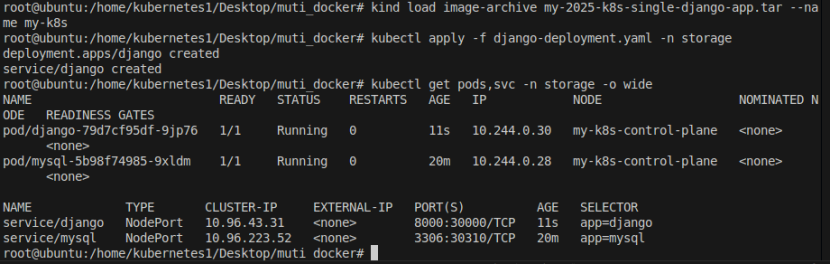
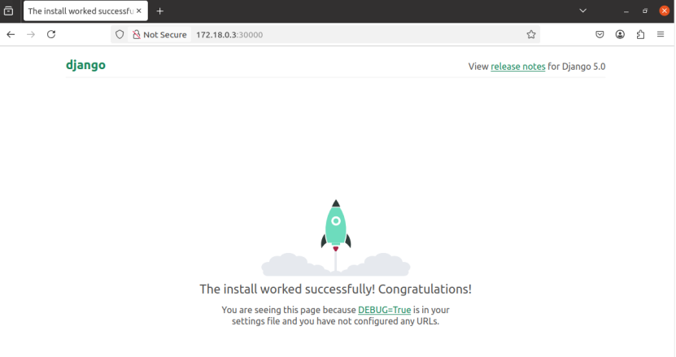

# 案例学习1：k8s集群部署django网页

前提：
1.在ubuntu20.04操作系统上完成了k8s的kind集群部署。
2.kind 集群名称 `my-k8s`

注意：涉及到的文件已存储在learn-k8s-django目录下。

---

## 在k8s中构建mysql数据库

1.首先，导入mysql数据库的镜像。

2.编写yaml文件：
具体见sql-k8s.yaml

3.部署到 Kubernetes
kubectl apply -f sql-k8s.yaml

---

## 构建django网页镜像

1.新建django工程

2.修改工程里的设置：settings.py
将使用的数据库修改为mysql数据库。

```python
DATABASES = {
    'default': {
        'ENGINE': 'django.db.backends.mysql',
        "NAME": "mytest",
        "USER": "root",
        "PASSWORD": os.environ.get("MYSQL_ROOT_PASSWORD"),  # 从环境变量获取密码
        "HOST": "mysql.storage.svc.cluster.local",  # MySQL 服务的 DNS 地址
        "PORT": "3306",  # MySQL 默认端口
        "OPTIONS": {
            "charset": "utf8mb4", # 使用 utf8mb4 编码支持表情等
            "init_command": "SET sql_mode='STRICT_TRANS_TABLES'"
        },
    }
}
```

4.保存，并在此工程下创建requirements.txt和Dockerfile

requirements.txt:
```txt
Django==5.0
mysqlclient==2.2.4
gunicorn==23.0.0
```

Dockerfile:
```Dockerfile
# 使用官方 Python 镜像作为基础镜像
FROM python:3.10-slim

# 设置工作目录
WORKDIR /app

# 安装构建 mysqlclient 所需的依赖
RUN apt-get update && \
    apt-get install -y --no-install-recommends \
    build-essential \
    gcc \
    pkg-config \
    libmariadb-dev \
    libmariadb-dev-compat && \
    rm -rf /var/lib/apt/lists/*  # 清理 apt 缓存以减小镜像体积
    
# 复制当前目录内容到容器
COPY . /app/

# 安装项目依赖
RUN pip install --no-cache-dir -r requirements.txt

# 运行数据库迁移并启动 Django 服务
CMD ["sh", "-c", "python manage.py migrate && gunicorn mysite.wsgi:application -b 0.0.0.0:8000"]
```
5.构建镜像
sudo docker build -t my-2025-k8s-single-django-app .

6.保存镜像
sudo docker save -o my-2025-k8s-single-django-app.tar my-2025-k8s-single-django-app:latest
sudo chmod 777 my-2025-k8s-single-django-app.tar

备注：此步骤制作的镜像在learn-k8s-django目录下可以找到。
---

## 在k8s集群上部署django网页

1.导入django镜像
kind load image-archive my-2025-k8s-single-django-app.tar --name my-k8s

2.编写yaml文件
具体见django-deployment.yaml

3.部署到特定命名空间
kubectl apply -f django-deployment.yaml -n storage


4.查看部署情况
kubectl get pods,svc -n storage -o wide

5.访问页面：http://172.18.0.3:30000/


